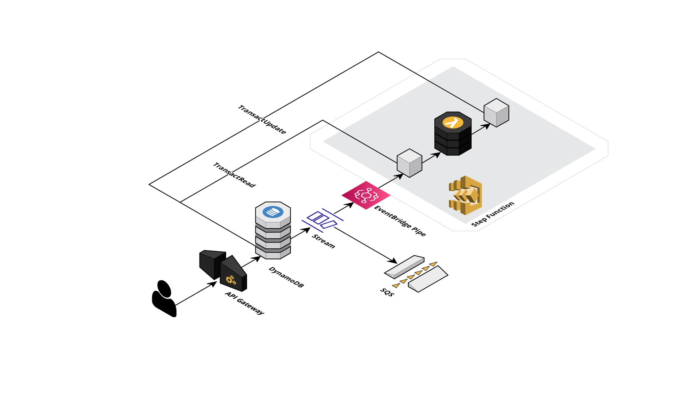

# ELO rating system - CDK TypeScript Construct

A level 3 CDK construct to deploy an ELO scoring stack in full serverless 🖖🏼



## Install

```bash
pnpm install elo-serverless
```

## Quickstart

```typescript
import * as cdk from 'aws-cdk-lib';
import { Construct } from 'constructs';
import { EloServerless } from 'elo-serverless';

export class MyCustomStack extends cdk.Stack {
  constructor(scope: Construct, id: string, props?: cdk.StackProps) {
    super(scope, id, props);

    new EloServerless(this, 'ELO Serverless');
  }
}
```

## Setup

The `src/lib` folder contains the CDK code used to deploy the `EloServerless` stack. The `src/test` folder defines the integration test that interacts with the `EloServerless` stack to check that it behaves as expected.
To setup your development environment:

- Run `pnpm cdk bootstrap aws://<YOUR_AWS_SSO_ACCOUNT_ID>/eu-west-1 --profile <YOUR_AWS_PROFILE>` to deploy a bootstrap stack (if you don't have one already)
- Run `pnpm cdk deploy --profile <YOUR_AWS_PROFILE>` to deploy `MyCustomStack` stack
- Run `pnpm integ-runner --directory lib --language typescript --update-on-failed --no-clean --parallel-regions eu-west-1 --profiles <YOUR_AWS_PROFILE>` to test `MyCustomStack` stack

_Note: if you have a credentials / SSO error, run `aws sso login --profile <YOUR_AWS_PROFILE>`_
